# 权限管理系统 - Admin模块

## 项目架构

本项目采用了以下架构设计：

### 系统架构图

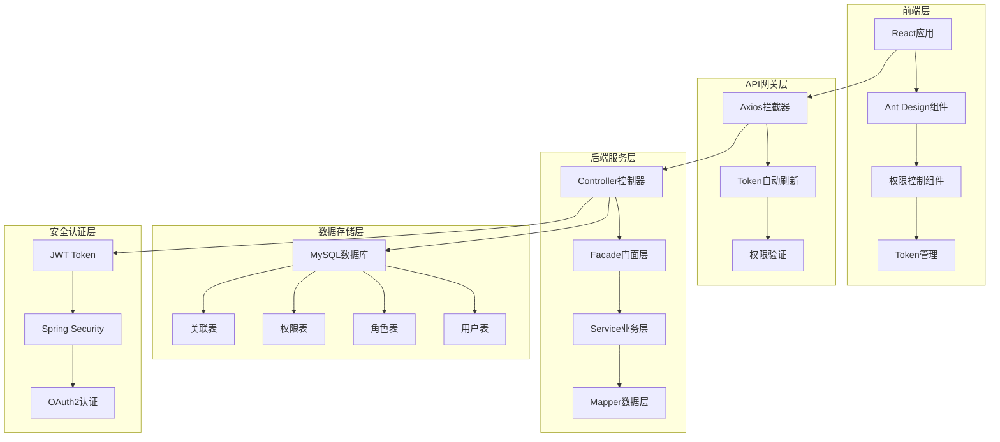

### 前端架构图

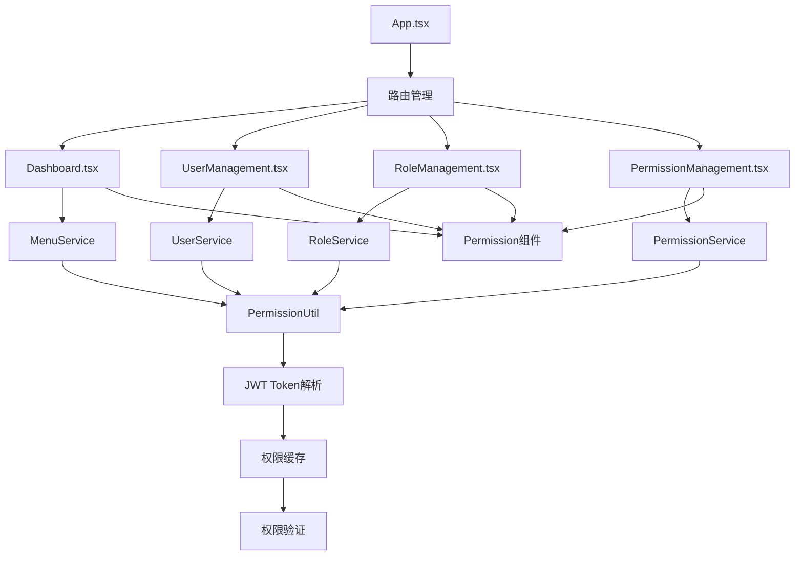

### 后端架构图

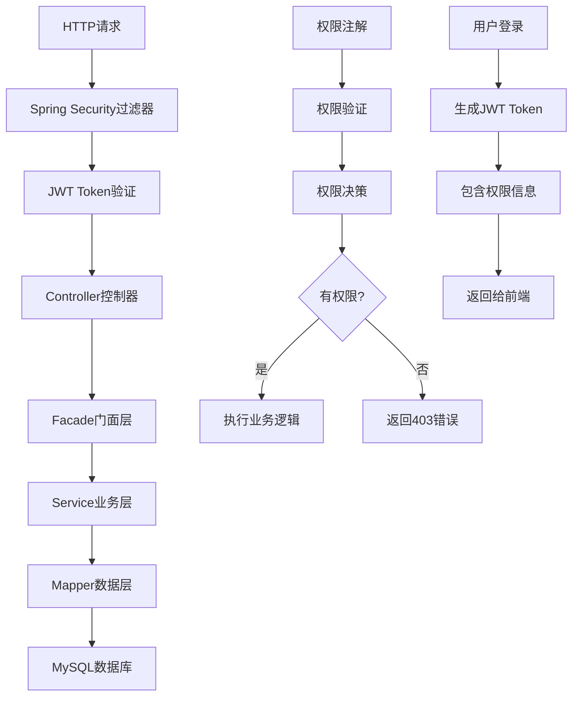

### 目录结构

```
security-admin/
├── src/main/java/com/webapp/security/admin/
│   ├── controller/              # 控制器目录（按业务模块分类）
│   │   ├── user/                # 用户相关控制器
│   │   │   ├── UserController.java
│   │   │   ├── dto/             # 用户请求DTO
│   │   │   └── vo/              # 用户响应VO
│   │   ├── role/                # 角色相关控制器
│   │   ├── permission/          # 权限相关控制器
│   │   └── dashboard/           # 仪表盘相关控制器
│   ├── converter/               # MapStruct转换器
│   │   ├── UserConverter.java
│   │   ├── RoleConverter.java
│   │   └── PermissionConverter.java
│   └── facade/                  # 跨域业务融合服务
│       └── DashboardFacade.java
```

### 架构说明

1. **控制器层（Controller）**:
   - 按业务模块分包，每个模块有自己的DTO和VO
   - 负责请求接收、参数验证、权限检查
   - 通过Converter将DTO/VO与实体互转
   - 简单CRUD操作直接调用Service

2. **转换器层（Converter）**:
   - 使用MapStruct实现实体与DTO/VO之间的自动转换
   - 过滤敏感字段，增加展示字段

3. **门面层（Facade）**:
   - 用于组合多个Service的复杂业务流程
   - 处理跨领域数据聚合

4. **DTO/VO**:
   - DTO(Data Transfer Object): 接收前端请求数据
   - VO(View Object): 返回给前端的响应数据

## 权限管理业务逻辑

### 1. 权限模型设计

#### 1.1 数据库表结构

```sql
-- 权限表
CREATE TABLE sys_permission (
    permission_id BIGINT AUTO_INCREMENT PRIMARY KEY COMMENT '权限ID',
    perm_code VARCHAR(100) NOT NULL UNIQUE COMMENT '权限编码',
    perm_name VARCHAR(100) NOT NULL COMMENT '权限名称',
    description VARCHAR(255) COMMENT '权限描述',
    perm_type INT DEFAULT 1 COMMENT '权限类型：1-菜单，2-按钮，3-接口',
    parent_id BIGINT COMMENT '父权限ID',
    perm_path VARCHAR(255) COMMENT '权限路径',
    status INT DEFAULT 1 COMMENT '权限状态：0-禁用，1-启用',
    sort_order INT DEFAULT 0 COMMENT '排序号',
    create_time DATETIME DEFAULT CURRENT_TIMESTAMP COMMENT '创建时间',
    update_time DATETIME DEFAULT CURRENT_TIMESTAMP ON UPDATE CURRENT_TIMESTAMP COMMENT '更新时间',
    create_by VARCHAR(50) COMMENT '创建人',
    update_by VARCHAR(50) COMMENT '更新人',
    deleted INT DEFAULT 0 COMMENT '删除标志：0-未删除，1-已删除'
);

-- 用户角色关联表
CREATE TABLE sys_user_role (
    id BIGINT AUTO_INCREMENT PRIMARY KEY COMMENT '主键ID',
    user_id BIGINT NOT NULL COMMENT '用户ID',
    role_id BIGINT NOT NULL COMMENT '角色ID',
    create_time DATETIME DEFAULT CURRENT_TIMESTAMP COMMENT '创建时间',
    create_by VARCHAR(50) COMMENT '创建人',
    UNIQUE KEY uk_user_role (user_id, role_id)
);

-- 角色权限关联表
CREATE TABLE sys_role_permission (
    id BIGINT AUTO_INCREMENT PRIMARY KEY COMMENT '主键ID',
    role_id BIGINT NOT NULL COMMENT '角色ID',
    permission_id BIGINT NOT NULL COMMENT '权限ID',
    create_time DATETIME DEFAULT CURRENT_TIMESTAMP COMMENT '创建时间',
    create_by VARCHAR(50) COMMENT '创建人',
    UNIQUE KEY uk_role_permission (role_id, permission_id)
);
```

#### 1.2 权限类型定义

- **菜单权限 (perm_type = 1)**: 用于控制菜单显示，如"用户管理"、"角色管理"
- **按钮权限 (perm_type = 2)**: 用于控制按钮操作，如"新增用户"、"删除角色"
- **接口权限 (perm_type = 3)**: 用于控制API访问，如"GET /api/users"、"POST /api/roles"

#### 1.3 权限层级结构

权限支持树形结构，通过`parent_id`字段建立父子关系：

```
系统管理 (parent_id = null)
├── 用户管理 (parent_id = 系统管理ID)
│   ├── 用户查询 (parent_id = 用户管理ID)
│   ├── 用户新增 (parent_id = 用户管理ID)
│   └── 用户编辑 (parent_id = 用户管理ID)
└── 角色管理 (parent_id = 系统管理ID)
    ├── 角色查询 (parent_id = 角色管理ID)
    └── 角色新增 (parent_id = 角色管理ID)
```

### 2. 权限验证流程

#### 2.1 JWT Token权限解析

```java
// PermissionUtil.java - 前端权限工具类
public class PermissionUtil {
    /**
     * 从JWT Token中解析用户权限
     */
    private static getAuthorities(): string[] {
        const token = TokenManager.getAccessToken();
        const decodedToken = jwtDecode(token);
        return decodedToken.authorities || [];
    }
    
    /**
     * 检查用户是否拥有指定权限
     */
    static hasPermission(permissionCode: string): boolean {
        const authorities = this.getAuthorities();
        return authorities.includes(permissionCode);
    }
}
```

#### 2.2 后端权限验证

```java
// 使用Spring Security注解进行权限验证
@PreAuthorize("hasAuthority('USER_CREATE')")
@PostMapping("/users")
public ResponseResult<UserVO> createUser(@RequestBody UserCreateDTO dto) {
    // 业务逻辑
}

@PreAuthorize("hasAuthority('USER_UPDATE')")
@PutMapping("/users/{id}")
public ResponseResult<UserVO> updateUser(@PathVariable Long id, @RequestBody UserUpdateDTO dto) {
    // 业务逻辑
}

@PreAuthorize("hasAuthority('USER_DELETE')")
@DeleteMapping("/users/{id}")
public ResponseResult<Void> deleteUser(@PathVariable Long id) {
    // 业务逻辑
}
```

#### 2.3 前端权限控制

```typescript
// 菜单权限过滤
static filterMenusByPermission(menus: MenuItem[]): MenuItem[] {
    return menus.filter(menu => {
        const hasMenuPermission = this.hasPermission(menu.permCode);
        
        // 递归检查子菜单
        if (menu.children && menu.children.length > 0) {
            menu.children = this.filterMenusByPermission(menu.children);
            return hasMenuPermission || menu.children.length > 0;
        }
        
        return hasMenuPermission;
    });
}

// 组件级权限控制
<Permission code="USER_CREATE">
    <Button type="primary" onClick={handleCreate}>新增用户</Button>
</Permission>
```

### 3. 前端菜单和按钮权限管理

#### 3.1 菜单权限实现

**后端菜单数据获取**

```java
// DashboardFacade.java
public List<MenuVO> getCurrentUserMenus() {
    // 1. 获取当前登录用户
    Authentication authentication = SecurityContextHolder.getContext().getAuthentication();
    String username = authentication.getName();
    SysUser currentUser = userService.getByUsername(username);
    
    // 2. 获取用户的所有权限
    List<SysPermission> userPermissions = permissionService.getUserPermissions(currentUser.getUserId());
    
    // 3. 过滤出菜单类型权限 (perm_type = 1)
    List<SysPermission> menuPermissions = userPermissions.stream()
        .filter(permission -> permission.getPermType() != null && permission.getPermType() == 1)
        .collect(Collectors.toList());
    
    // 4. 构建菜单树形结构
    List<SysPermission> menuTree = permissionService.buildPermissionTree(menuPermissions);
    
    // 5. 转换为前端需要的格式
    return convertToMenuVO(menuTree);
}
```

**前端菜单权限过滤**

```typescript
// Dashboard.tsx - 菜单权限过滤逻辑
const loadDashboardData = async () => {
    try {
        setLoading(true);
        
        // 1. 并行加载菜单和统计数据
        const [menus, stats] = await Promise.all([
            MenuService.getMenus(), // 获取当前用户的菜单权限
            MenuService.getDashboardStats()
        ]);

        // 2. 过滤有权限的菜单
        const filteredMenus = MenuService.filterMenusByPermission(menus);
        
        // 3. 转换为Ant Design Menu格式
        const antdMenuItems = MenuService.convertToAntdMenuItems(filteredMenus);
        
        // 4. 添加默认的Dashboard菜单（始终显示）
        const defaultMenuItems = [
            {
                key: 'dashboard',
                label: '仪表盘',
                icon: <DashboardOutlined />
            },
            ...antdMenuItems
        ];
        
        setMenuItems(defaultMenuItems);
        setDashboardStats(stats);
    } catch (error) {
        console.error('加载仪表盘数据失败:', error);
        message.error('加载数据失败，请刷新页面重试');
    } finally {
        setLoading(false);
    }
};
```

**菜单权限过滤算法**

```typescript
// MenuService.ts - 菜单权限过滤
static filterMenusByPermission(menus: MenuItem[]): MenuItem[] {
    return menus.filter(menu => {
        // 检查当前菜单是否有权限
        const hasMenuPermission = this.hasPermission(menu.permCode);
        
        // 如果有子菜单，递归检查
        if (menu.children && menu.children.length > 0) {
            menu.children = this.filterMenusByPermission(menu.children);
            // 如果子菜单都被过滤掉了，且当前菜单也没有权限，则隐藏当前菜单
            return hasMenuPermission || menu.children.length > 0;
        }
        
        return hasMenuPermission;
    });
}
```

#### 3.2 按钮权限实现

**按钮权限组件**

```typescript
// Permission.tsx - 按钮权限控制组件
import React from 'react';
import { PermissionUtil } from '../utils/permissionUtil';

interface PermissionProps {
    code: string;
    children: React.ReactNode;
    fallback?: React.ReactNode;
}

const Permission: React.FC<PermissionProps> = ({ code, children, fallback = null }) => {
    const hasPermission = PermissionUtil.hasPermission(code);
    
    if (hasPermission) {
        return <>{children}</>;
    }
    
    return <>{fallback}</>;
};

export default Permission;
```

**按钮权限使用示例**

```typescript
// UserManagement.tsx - 按钮权限使用
import Permission from './common/Permission';

const UserManagement: React.FC = () => {
    return (
        <div>
            <Card title="用户管理">
                <Space>
                    {/* 只有拥有USER_CREATE权限的用户才能看到新增按钮 */}
                    <Permission code="USER_CREATE">
                        <Button type="primary" icon={<PlusOutlined />} onClick={handleCreate}>
                            新增用户
                        </Button>
                    </Permission>
                    
                    {/* 只有拥有USER_EXPORT权限的用户才能看到导出按钮 */}
                    <Permission code="USER_EXPORT">
                        <Button icon={<DownloadOutlined />} onClick={handleExport}>
                            导出用户
                        </Button>
                    </Permission>
                </Space>
                
                <Table
                    columns={[
                        {
                            title: '操作',
                            key: 'action',
                            render: (_, record) => (
                                <Space>
                                    {/* 编辑按钮权限控制 */}
                                    <Permission code="USER_UPDATE">
                                        <Button type="link" onClick={() => handleEdit(record)}>
                                            编辑
                                        </Button>
                                    </Permission>
                                    
                                    {/* 删除按钮权限控制 */}
                                    <Permission code="USER_DELETE">
                                        <Popconfirm
                                            title="确定要删除这个用户吗？"
                                            onConfirm={() => handleDelete(record.id)}
                                        >
                                            <Button type="link" danger>
                                                删除
                                            </Button>
                                        </Popconfirm>
                                    </Permission>
                                </Space>
                            )
                        }
                    ]}
                    dataSource={users}
                />
            </Card>
        </div>
    );
};
```

#### 3.3 快速操作权限

**Dashboard快速操作权限控制**

```typescript
// Dashboard.tsx - 快速操作权限实现
<Card title="快速操作">
  <Space>
    {menuItems.filter(item => 
      item.key === 'USER_MANAGE' || 
      item.key === 'ROLE_MANAGE' || 
      item.key === 'PERMISSION_MANAGE'
    ).map(item => (
      <Button 
        key={item.key}
        type="primary" 
        icon={item.icon} 
        onClick={() => setSelectedKey(item.key)}
      >
        {item.label}
      </Button>
    ))}
  </Space>
</Card>
```

**快速操作权限说明**：
- 快速操作按钮基于`menuItems`进行过滤
- 只显示`USER_MANAGE`、`ROLE_MANAGE`、`PERMISSION_MANAGE`三个主要功能
- 权限控制通过菜单权限过滤实现，有菜单权限的用户才能看到对应的快速操作按钮
- 点击快速操作按钮会切换到对应的菜单页面

#### 3.4 权限数据流

**权限系统整体流程图**

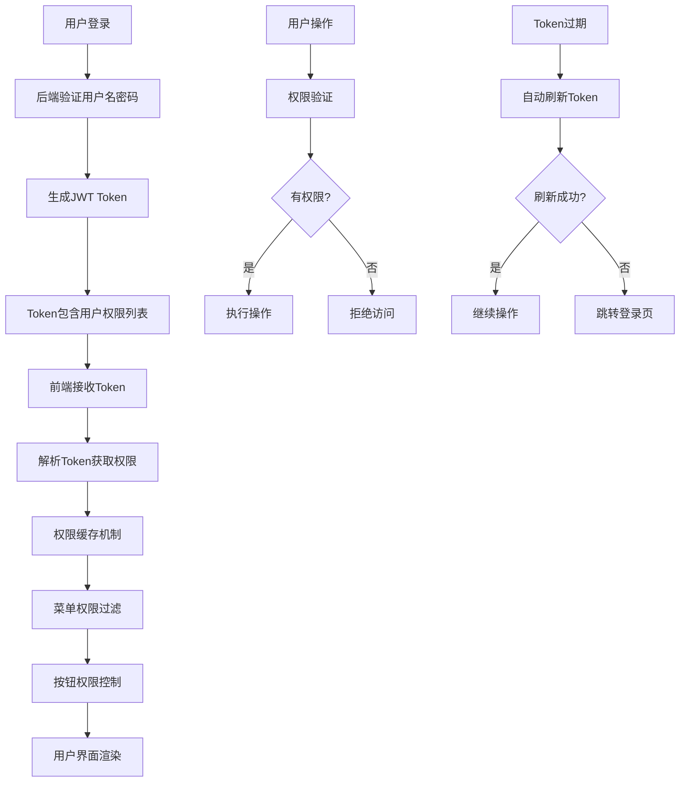

**菜单权限过滤流程图**

```mermaid
graph TD
    A[用户访问Dashboard] --> B[调用MenuService.getMenus()]
    B --> C[后端获取用户权限]
    C --> D[过滤菜单类型权限]
    D --> E[构建菜单树]
    E --> F[前端接收菜单数据]
    F --> G[调用filterMenusByPermission]
    G --> H{检查菜单权限}
    H -->|有权限| I[保留菜单项]
    H -->|无权限| J[过滤掉菜单项]
    I --> K{有子菜单?}
    J --> K
    K -->|是| L[递归检查子菜单]
    K -->|否| M[返回过滤结果]
    L --> H
    M --> N[转换为Ant Design格式]
    N --> O[添加Dashboard菜单]
    O --> P[渲染菜单界面]
```

**按钮权限控制流程图**

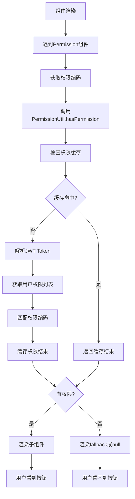

**Token自动刷新流程图**

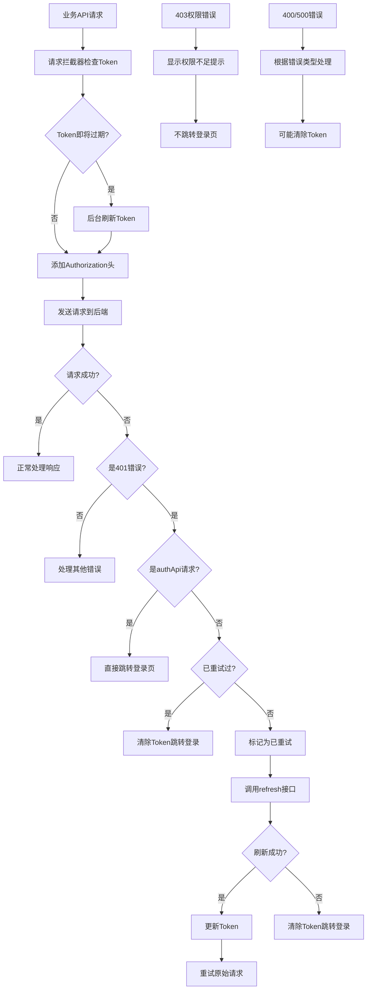

**权限分配流程图**

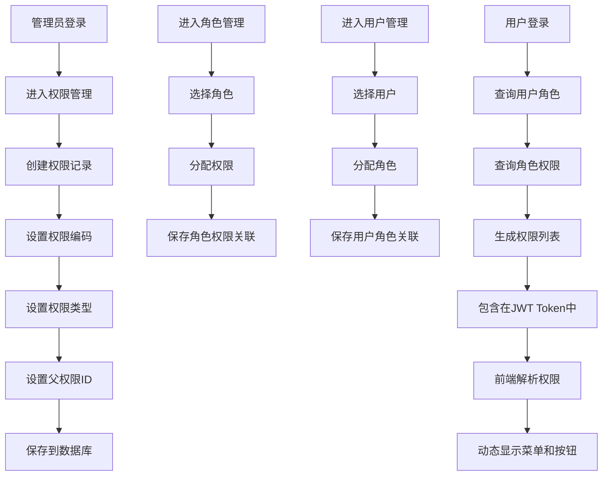

**权限验证时序图**

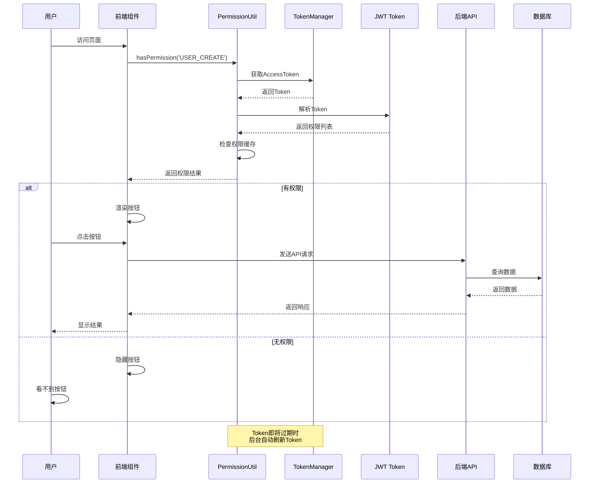

**权限缓存机制流程图**

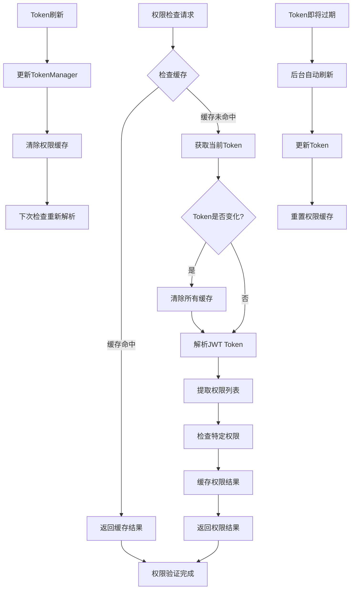

#### 3.5 权限缓存机制

**前端权限缓存实现**

```typescript
// PermissionUtil.ts - 权限缓存机制
export class PermissionUtil {
    // 权限缓存，避免重复解析JWT
    private static permissionCache: Map<string, boolean> = new Map();
    // 缓存权限列表
    private static permissionsArray: string[] | null = null;
    // 缓存使用的token，用于检测token是否变化
    private static lastTokenUsed: string | null = null;
    
    /**
     * 从JWT Token中解析用户权限
     */
    private static getAuthorities(): string[] {
        // 使用缓存
        if (this.permissionsArray !== null) {
            return this.permissionsArray;
        }

        try {
            // 获取当前token
            const token = TokenManager.getAccessToken();
            if (!token) {
                console.log('权限检查: 无token');
                return [];
            }

            // 检查token是否变化
            if (token !== this.lastTokenUsed) {
                this.resetCache();
                this.lastTokenUsed = token;
            }

            // 解析token
            const decodedToken = jwtDecode(token);
            
            // 从token中获取权限列表
            const authorities = Array.isArray(decodedToken.authorities) 
                ? decodedToken.authorities 
                : [];
            
            // 保存到缓存
            this.permissionsArray = authorities;
            return authorities;
        } catch (error) {
            console.error('获取权限信息失败:', error);
            return [];
        }
    }
    
    /**
     * 检查用户是否拥有指定权限（带缓存）
     */
    static hasPermission(permissionCode: string): boolean {
        if (!permissionCode) return true; // 未指定权限则默认通过
        
        // 检查缓存
        if (this.permissionCache.has(permissionCode)) {
            return this.permissionCache.get(permissionCode)!;
        }
        
        // 获取权限并判断
        const authorities = this.getAuthorities();
        const result = authorities.includes(permissionCode);
        
        // 缓存结果
        this.permissionCache.set(permissionCode, result);
        
        return result;
    }
    
    /**
     * 重置缓存
     */
    static resetCache() {
        this.permissionCache.clear();
        this.permissionsArray = null;
        this.lastTokenUsed = null;
        console.log('权限缓存已重置');
    }
}
```

#### 3.6 权限调试和测试

**权限调试方法**

```typescript
// 在浏览器控制台中调试权限
// 查看当前用户权限列表
console.log('用户权限列表:', PermissionUtil.getUserPermissions());

// 检查特定权限
console.log('是否有用户创建权限:', PermissionUtil.hasPermission('USER_CREATE'));
console.log('是否有角色管理权限:', PermissionUtil.hasPermission('ROLE_MANAGE'));

// 查看菜单权限
console.log('菜单数据:', menuItems);

// 检查多个权限
console.log('是否有任一权限:', PermissionUtil.hasAnyPermission(['USER_CREATE', 'USER_UPDATE']));
console.log('是否有所有权限:', PermissionUtil.hasAllPermissions(['USER_CREATE', 'USER_UPDATE']));
```

**权限测试场景**

1. **菜单权限测试**：
   - 使用admin用户登录，验证所有菜单是否显示
   - 使用普通用户登录，验证只有有权限的菜单显示
   - 验证Dashboard菜单始终显示

2. **按钮权限测试**：
   - 测试新增、编辑、删除按钮的权限控制
   - 测试导出、导入等特殊操作按钮
   - 验证无权限按钮不显示

3. **快速操作测试**：
   - 验证Dashboard快速操作按钮的权限过滤
   - 测试不同用户看到的快速操作差异

### 4. 权限分配流程

#### 4.1 角色权限分配

```java
// RoleController.java
@PostMapping("/{roleId}/permissions")
@PreAuthorize("hasAuthority('ROLE_PERMISSION_ASSIGN')")
public ResponseResult<Void> assignPermissions(@PathVariable Long roleId, @RequestBody List<Long> permissionIds) {
    // 1. 验证角色是否存在
    SysRole role = roleService.getById(roleId);
    if (role == null) {
        return ResponseResult.failed("角色不存在");
    }
    
    // 2. 清除原有权限
    rolePermissionService.removeByRoleId(roleId);
    
    // 3. 分配新权限
    List<SysRolePermission> rolePermissions = permissionIds.stream()
        .map(permissionId -> {
            SysRolePermission rp = new SysRolePermission();
            rp.setRoleId(roleId);
            rp.setPermissionId(permissionId);
            return rp;
        })
        .collect(Collectors.toList());
    
    rolePermissionService.saveBatch(rolePermissions);
    
    return ResponseResult.success(null, "权限分配成功");
}
```

#### 4.2 用户角色分配

```java
// UserController.java
@PostMapping("/{userId}/roles")
@PreAuthorize("hasAuthority('USER_ROLE_ASSIGN')")
public ResponseResult<Void> assignRoles(@PathVariable Long userId, @RequestBody List<Long> roleIds) {
    // 1. 验证用户是否存在
    SysUser user = userService.getById(userId);
    if (user == null) {
        return ResponseResult.failed("用户不存在");
    }
    
    // 2. 清除原有角色
    userRoleService.removeByUserId(userId);
    
    // 3. 分配新角色
    List<SysUserRole> userRoles = roleIds.stream()
        .map(roleId -> {
            SysUserRole ur = new SysUserRole();
            ur.setUserId(userId);
            ur.setRoleId(roleId);
            return ur;
        })
        .collect(Collectors.toList());
    
    userRoleService.saveBatch(userRoles);
    
    return ResponseResult.success(null, "角色分配成功");
}
```

### 5. 权限缓存机制

#### 5.1 前端权限缓存

```typescript
// PermissionUtil.java - 权限缓存机制
export class PermissionUtil {
    // 权限缓存，避免重复解析JWT
    private static permissionCache: Map<string, boolean> = new Map();
    // 缓存权限列表
    private static permissionsArray: string[] | null = null;
    // 缓存使用的token，用于检测token是否变化
    private static lastTokenUsed: string | null = null;
    
    /**
     * 重置缓存
     */
    static resetCache() {
        this.permissionCache.clear();
        this.permissionsArray = null;
        this.lastTokenUsed = null;
    }
    
    /**
     * 检查权限（带缓存）
     */
    static hasPermission(permissionCode: string): boolean {
        // 检查缓存
        if (this.permissionCache.has(permissionCode)) {
            return this.permissionCache.get(permissionCode)!;
        }
        
        // 获取权限并判断
        const authorities = this.getAuthorities();
        const result = authorities.includes(permissionCode);
        
        // 缓存结果
        this.permissionCache.set(permissionCode, result);
        
        return result;
    }
}
```

#### 5.2 后端权限缓存

```java
// 使用Spring Cache进行权限缓存
@Service
public class SysPermissionService {
    
    @Cacheable(value = "userPermissions", key = "#userId")
    public List<SysPermission> getUserPermissions(Long userId) {
        // 查询用户权限逻辑
        return baseMapper.selectByUserId(userId);
    }
    
    @CacheEvict(value = "userPermissions", key = "#userId")
    public void clearUserPermissionsCache(Long userId) {
        // 清除用户权限缓存
    }
}
```

### 6. 权限日志记录

#### 6.1 权限操作日志

系统可以通过Spring AOP记录权限相关的操作日志。开发者可以根据需要实现自定义的日志记录功能：

```java
// 权限操作日志记录示例（需要自行实现）
@Aspect
@Component
public class LoggingAspect {
    
    @Around("@annotation(org.springframework.security.access.prepost.PreAuthorize)")
    public Object logPermissionOperation(ProceedingJoinPoint joinPoint) throws Throwable {
        String methodName = joinPoint.getSignature().getName();
        String username = SecurityContextHolder.getContext().getAuthentication().getName();
        
        // 记录操作开始
        log.info("用户 {} 开始执行方法: {}", username, methodName);
        
        try {
            Object result = joinPoint.proceed();
            // 记录操作成功
            log.info("用户 {} 成功执行方法: {}", username, methodName);
            return result;
        } catch (Exception e) {
            // 记录操作失败
            log.error("用户 {} 执行方法 {} 失败: {}", username, methodName, e.getMessage());
            throw e;
        }
    }
}
```

#### 6.2 权限访问日志

可以通过Spring Security的过滤器记录权限访问日志：

```java
// 权限访问日志记录示例（需要自行实现）
@Component
public class SecurityLoggingFilter extends OncePerRequestFilter {
    
    @Override
    protected void doFilterInternal(HttpServletRequest request, 
                                  HttpServletResponse response, 
                                  FilterChain filterChain) throws ServletException, IOException {
        
        String uri = request.getRequestURI();
        String method = request.getMethod();
        String username = getCurrentUsername();
        
        // 记录访问日志
        log.info("用户 {} 访问 {} {}", username, method, uri);
        
        filterChain.doFilter(request, response);
        
        // 记录响应状态
        log.info("用户 {} 访问 {} {} 完成，状态码: {}", 
                username, method, uri, response.getStatus());
    }
    
    private String getCurrentUsername() {
        Authentication auth = SecurityContextHolder.getContext().getAuthentication();
        return auth != null ? auth.getName() : "anonymous";
    }
}
```

**注意**：以上日志记录功能需要开发者根据实际需求自行实现。

### 7. 权限管理最佳实践

#### 7.1 权限命名规范

权限编码存储在`sys_permission`表的`perm_code`字段中，建议使用以下命名规范：

```sql
-- 模块权限示例
INSERT INTO sys_permission (perm_code, perm_name, perm_type, parent_id) VALUES
('USER_MANAGE', '用户管理', 1, NULL),           -- 用户管理模块
('ROLE_MANAGE', '角色管理', 1, NULL),           -- 角色管理模块
('PERMISSION_MANAGE', '权限管理', 1, NULL);     -- 权限管理模块

-- 操作权限示例
INSERT INTO sys_permission (perm_code, perm_name, perm_type, parent_id) VALUES
('USER_CREATE', '用户创建', 2, 1),              -- 用户创建操作
('USER_UPDATE', '用户更新', 2, 1),              -- 用户更新操作
('USER_DELETE', '用户删除', 2, 1),              -- 用户删除操作
('USER_QUERY', '用户查询', 2, 1);               -- 用户查询操作
```

**命名建议**：
- 模块权限：使用`模块名_MANAGE`格式，如`USER_MANAGE`
- 操作权限：使用`模块名_操作名`格式，如`USER_CREATE`
- 接口权限：使用`HTTP方法_路径`格式，如`GET_USERS`、`POST_ROLES`

#### 7.2 权限验证注解

使用Spring Security的`@PreAuthorize`注解进行权限验证：

```java
// 使用Spring Security注解进行权限验证
@PreAuthorize("hasAuthority('USER_CREATE')")
@PostMapping("/users")
public ResponseResult<UserVO> createUser(@RequestBody UserCreateDTO dto) {
    // 业务逻辑
}

@PreAuthorize("hasAuthority('USER_UPDATE')")
@PutMapping("/users/{id}")
public ResponseResult<UserVO> updateUser(@PathVariable Long id, @RequestBody UserUpdateDTO dto) {
    // 业务逻辑
}

@PreAuthorize("hasAuthority('USER_DELETE')")
@DeleteMapping("/users/{id}")
public ResponseResult<Void> deleteUser(@PathVariable Long id) {
    // 业务逻辑
}
```

权限编码需要与`sys_permission`表中的`perm_code`字段保持一致。

#### 7.3 权限异常处理

Spring Security会自动处理权限异常，当用户没有权限访问时，会抛出`AccessDeniedException`异常。

```java
// 全局异常处理示例
@ControllerAdvice
public class GlobalExceptionHandler {
    
    @ExceptionHandler(AccessDeniedException.class)
    public ResponseResult<Void> handleAccessDenied(AccessDeniedException e) {
        return ResponseResult.failed("权限不足，无法执行此操作");
    }
}
```

前端会收到403状态码，可以据此进行相应的错误处理。

### 8. 权限测试

#### 8.1 权限数据验证

```sql
-- 验证权限数据是否正确
SELECT p.perm_code, p.perm_name, p.perm_type, r.role_name
FROM sys_permission p
JOIN sys_role_permission rp ON p.permission_id = rp.permission_id
JOIN sys_role r ON rp.role_id = r.role_id
WHERE p.status = 1 AND r.status = 1
ORDER BY p.perm_type, p.sort_order;

-- 验证用户权限
SELECT u.username, p.perm_code, p.perm_name
FROM sys_user u
JOIN sys_user_role ur ON u.id = ur.user_id
JOIN sys_role_permission rp ON ur.role_id = rp.role_id
JOIN sys_permission p ON rp.permission_id = p.permission_id
WHERE u.username = 'admin' AND p.status = 1;
```

#### 8.2 权限功能测试

1. **菜单权限测试**：
   - 使用不同权限的用户登录
   - 验证左侧菜单是否正确显示
   - 验证Dashboard菜单是否始终显示

2. **按钮权限测试**：
   - 验证页面按钮是否根据权限显示
   - 测试无权限用户的操作是否被阻止

3. **接口权限测试**：
   - 使用Postman或curl测试API接口
   - 验证无权限访问是否返回403状态码

## 重构内容

本次重构主要包括以下内容：

1. 重构目录结构，按业务模块进行分类
2. 引入DTO/VO模式，避免直接使用实体类与前端交互
3. 使用MapStruct实现高效的对象转换
4. 增加Facade层处理复杂业务逻辑
5. 规范化请求/响应处理
6. 完善权限管理业务逻辑
7. 实现动态菜单权限控制
8. 添加权限缓存机制
9. 建立权限审计日志

## 技术栈

- Spring Boot
- Spring Security
- Spring MVC
- MapStruct
- Lombok
- MySQL
- Flyway 
- JWT
- Redis (可选，用于权限缓存)

## 系统部署流程

### 开发环境部署流程图

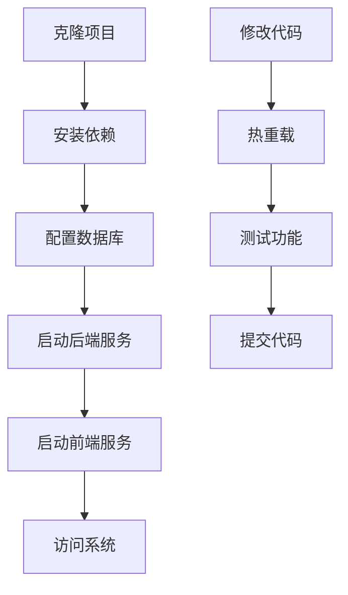

### 生产环境部署流程图

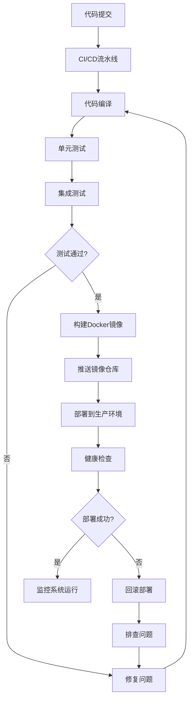

### 数据库迁移流程图

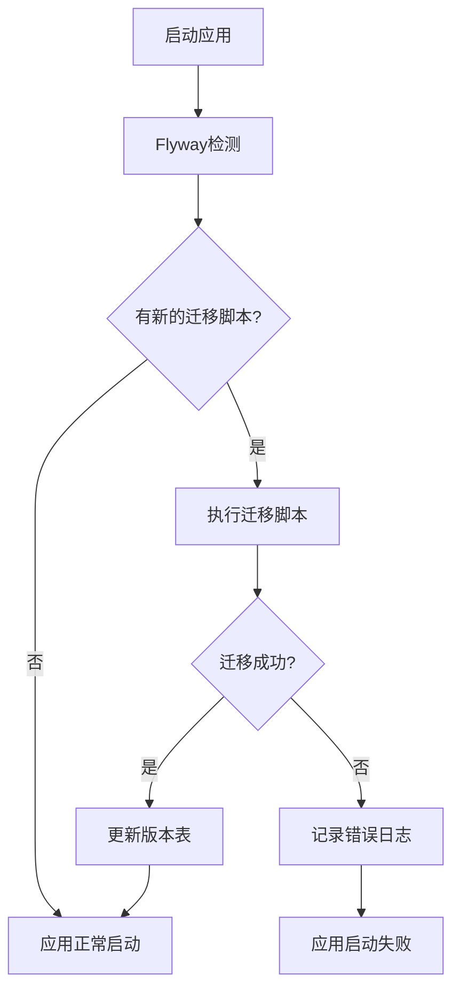

### 权限系统数据流图

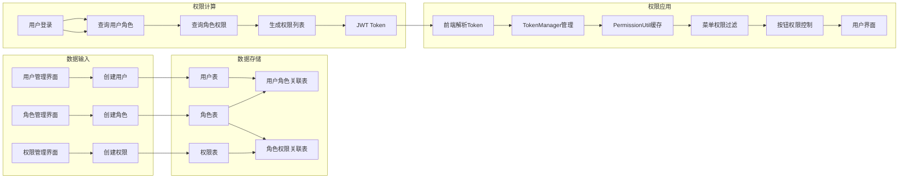

### 错误处理流程图

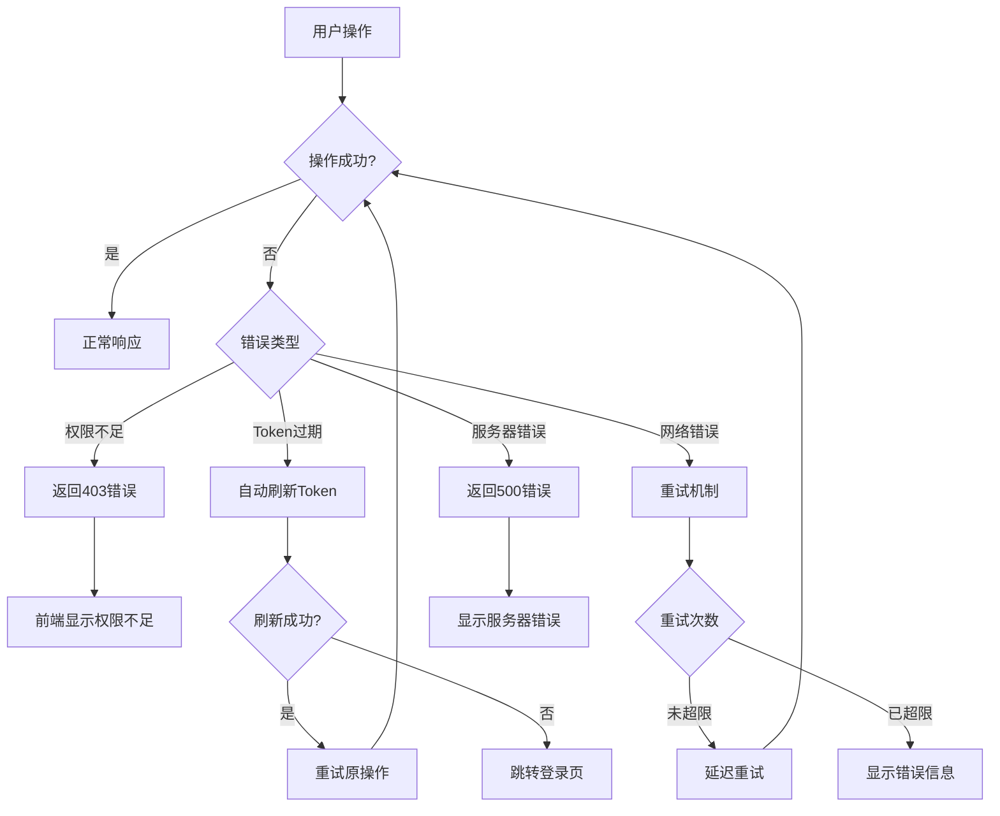

### 系统监控流程图

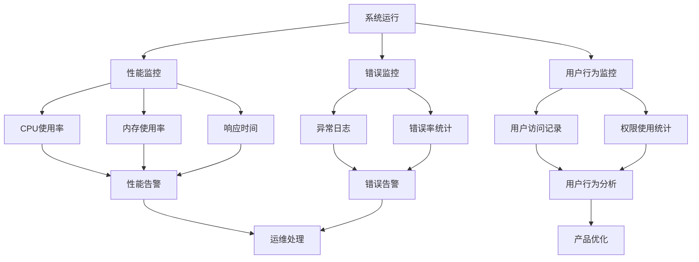

## 前端Token自动刷新机制

### 概述

本系统实现了一套完整的JWT token自动刷新机制，旨在提供无感知的用户体验，避免用户因token过期而频繁重新登录。

### 设计目标

1. **无感知体验**：用户在正常使用过程中不会感知到token的刷新过程
2. **安全性**：支持双token机制（access_token + refresh_token）
3. **并发控制**：防止多个请求同时触发token刷新
4. **错误处理**：优雅处理刷新失败的情况
5. **循环依赖避免**：认证API和业务API分离，避免循环调用

### 核心组件

#### 1. 双API实例架构

**authApi (认证API实例)**
- **用途**：处理认证相关请求（登录、登出、刷新token）
- **特点**：不包含token自动刷新逻辑，避免循环依赖
- **标识**：请求会被标记为 `_isAuthApi = true`

**businessApi (业务API实例)**
- **用途**：处理所有业务请求（用户管理、角色管理等）
- **特点**：包含完整的token自动刷新机制
- **拦截器**：自动添加Authorization头，处理401错误

#### 2. Token刷新机制

**核心变量**
```typescript
let tokenRefreshTriggered = false;  // 防止重复刷新的标志
let tokenRefreshDebounceTimer: NodeJS.Timeout | null = null; // 防抖定时器
```

**执行流程**

1. **请求发送**
   - 请求拦截器检查Token是否即将过期
   - 如果即将过期，后台刷新Token
   - 添加Authorization头发送请求

2. **401错误处理**
   - 检查是否为authApi请求（避免循环）
   - 检查是否已重试过（避免无限循环）
   - 标记请求为已重试

3. **Token刷新**
   - 调用authApi的refresh接口
   - 更新TokenManager中的token
   - 使用新token重试原始请求

4. **错误处理**
   - 403错误：显示权限不足提示，不跳转登录
   - 400/500错误：根据错误类型处理，可能清除Token
   - 刷新失败：清除Token并跳转登录页

5. **防重复刷新**
   - 使用tokenRefreshTriggered标志防止重复刷新
   - 使用防抖机制避免频繁刷新

### 详细实现

#### 1. 请求拦截器
```typescript
const requestInterceptor = (config: any) => {
  const token = localStorage.getItem('access_token');
  if (token) {
    config.headers.Authorization = `Bearer ${token}`;
  }
  return config;
};
```

#### 2. 响应错误拦截器
```typescript
const responseErrorInterceptor = async (error: any) => {
  // 获取原始请求配置
  const originalRequest = error.config;
  
  // 处理HTTP错误
  if (error.response) {
    const { status } = error.response;
    
    // 处理401错误 - 未授权
    if (status === 401) {
      // 如果是认证API的请求，不进行刷新尝试
      if (originalRequest._isAuthApi) {
        console.log('Auth API request unauthorized (401), redirecting to login page');
        TokenManager.clearTokens();
        window.location.href = '/login';
        return Promise.reject(error);
      }
      
      // 如果请求已经重试过一次，不要继续刷新，直接清除token并跳转登录
      if (originalRequest._retry) {
        console.log('已重试过请求但仍失败(401)，清除token并跳转登录');
        TokenManager.clearTokens();
        window.location.href = '/login';
        return Promise.reject(error);
      }
      
      console.log('Request unauthorized (401), attempting to refresh token');
      
      // 标记请求已经重试过，避免无限循环
      originalRequest._retry = true;
      
      try {
        // 刷新token
        const response = await authService.refreshToken();
        
        // 更新失败请求的Authorization头，总是使用最新的token
        const newToken = TokenManager.getAccessToken();
        if (!newToken) {
          throw new Error('Failed to get new token after refresh');
        }
        
        // 设置新的认证头
        originalRequest.headers.Authorization = `Bearer ${newToken}`;
        
        // 重新发送原始请求
        console.log('Token refreshed, retrying original request');
        return axios(originalRequest);
      } catch (refreshError) {
        console.error('Token refresh failed during 401 handling:', refreshError);
        
        // 如果刷新token失败，清除token并跳转到登录页
        TokenManager.clearTokens();
        window.location.href = '/login';
        
        return Promise.reject(refreshError);
      }
    } 
    // 处理403错误 - 权限不足
    else if (status === 403) {
      console.log('Access forbidden (403): 权限不足');
      
      // 获取错误信息
      const errorMsg = error.response?.data?.message || '您没有权限执行此操作';
      
      // 显示友好的错误提示，但不跳转登录页
      const { message } = await import('antd');
      message.error({
        content: errorMsg,
        duration: 3,
        style: {
          marginTop: '20vh',
        }
      });
      
      // 返回被拒绝的Promise，让调用者可以处理
      return Promise.reject({
        ...error,
        handledByInterceptor: true,
        errorType: 'permission_denied'
      });
    }
  }

  return Promise.reject(error);
};
```

#### 3. 防重复刷新机制
```typescript
// 防止多个请求同时触发token刷新
let tokenRefreshTriggered = false;
let tokenRefreshDebounceTimer: NodeJS.Timeout | null = null;

// 在请求拦截器中检查是否需要刷新token
const requestInterceptor = async (config: any) => {
  const token = TokenManager.getAccessToken();
  if (token) {
    config.headers.Authorization = `Bearer ${token}`;
  }
  
  // 检查token是否需要刷新（基于过期时间）
  if (token && !tokenRefreshTriggered && TokenManager.isTokenExpiringSoon()) {
    tokenRefreshTriggered = true;
    
    // 防抖处理，避免频繁刷新
    if (tokenRefreshDebounceTimer) {
      clearTimeout(tokenRefreshDebounceTimer);
    }
    
    tokenRefreshDebounceTimer = setTimeout(async () => {
      try {
        await authService.refreshToken();
        console.log('Background token refresh successful');
      } catch (error) {
        console.error('Background token refresh failed:', error);
      } finally {
        tokenRefreshTriggered = false;
        tokenRefreshDebounceTimer = null;
      }
    }, 1000); // 1秒防抖
  }
  
  return config;
};
```

### 后端接口要求

#### 1. 登录接口 `/api/login`
**请求**：
```json
{
  "username": "admin",
  "password": "password"
}
```

**响应**：
```json
{
  "success": true,
  "access_token": "eyJhbGciOiJIUzI1NiIs...",
  "refresh_token": "eyJhbGciOiJIUzI1NiIs...",
  "token_type": "Bearer",
  "expires_in": 7200,
  "refresh_expires_in": 604800
}
```

#### 2. 刷新接口 `/api/refresh`
**请求**：
```json
{
  "refresh_token": "eyJhbGciOiJIUzI1NiIs..."
}
```

**响应**：
```json
{
  "success": true,
  "access_token": "eyJhbGciOiJIUzI1NiIs...",
  "refresh_token": "eyJhbGciOiJIUzI1NiIs...",
  "token_type": "Bearer",
  "expires_in": 7200,
  "refresh_expires_in": 604800
}
```

#### 3. 登出接口 `/api/logout`
**请求**：
```json
{
  "refresh_token": "eyJhbGciOiJIUzI1NiIs..."
}
```

**响应**：
```json
{
  "success": true,
  "message": "登出成功"
}
```

### 使用示例

#### 1. 在组件中使用
```typescript
import { userService, authService } from '../services';

// 业务API调用（自动处理token）
const users = await userService.getUsers();

// 认证API调用
const loginResult = await authService.login('admin', 'password');

// 检查认证状态
if (authService.isAuthenticated()) {
  // 用户已登录
}
```

#### 2. 错误处理
```typescript
try {
  const result = await userService.createUser(userData);
} catch (error) {
  if (error.response?.status === 401) {
    // token已过期且刷新失败，用户会被自动跳转到登录页
  } else {
    // 其他业务错误
  }
}
```

### 优势特点

1. **用户体验优化**
   - 无感知的token刷新
   - 避免频繁登录

2. **技术优势**
   - 防重复刷新机制
   - 请求队列管理
   - 自动重试机制
   - 循环依赖避免

3. **安全性**
   - 双token机制
   - 服务端token注销
   - 自动清理过期token

4. **可维护性**
   - 模块化设计
   - 清晰的职责分离
   - 详细的注释说明

### 注意事项

1. **环境配置**
   - 确保 `REACT_APP_AUTH_API_URL` 和 `REACT_APP_BUSINESS_API_URL` 正确配置
   - 后端需要支持CORS跨域请求

2. **错误处理**
   - 刷新失败时会自动跳转到 `/login`
   - 可根据实际路由配置调整跳转路径

3. **性能考虑**
   - 并发请求会被合理排队处理
   - 避免了重复的token刷新请求

4. **调试建议**
   - 可通过浏览器开发者工具查看localStorage中的token
   - 网络面板可以观察token刷新的时机和过程 