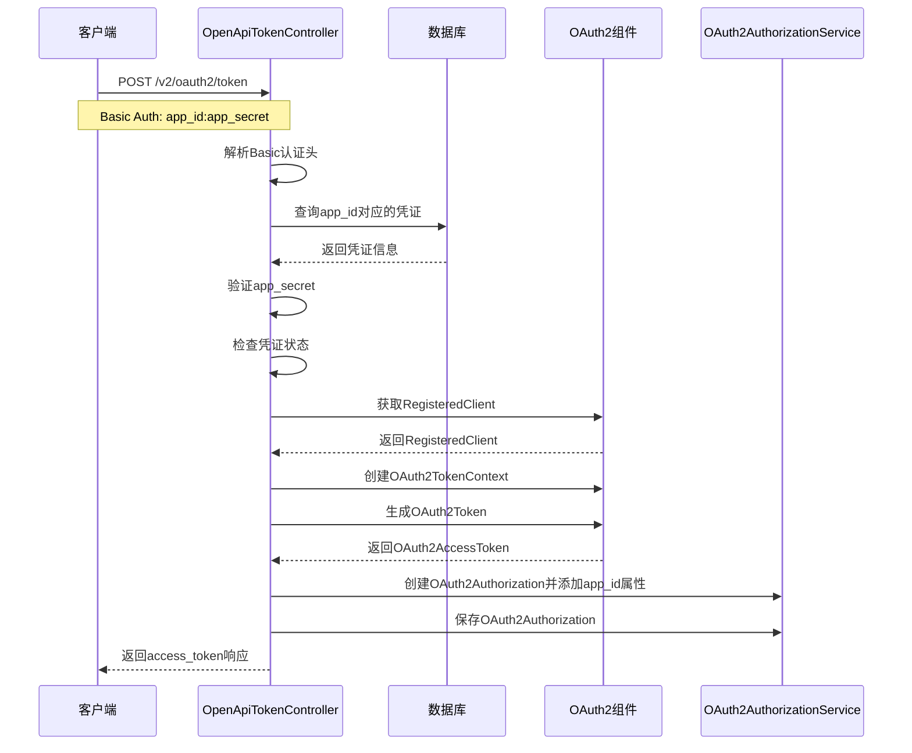
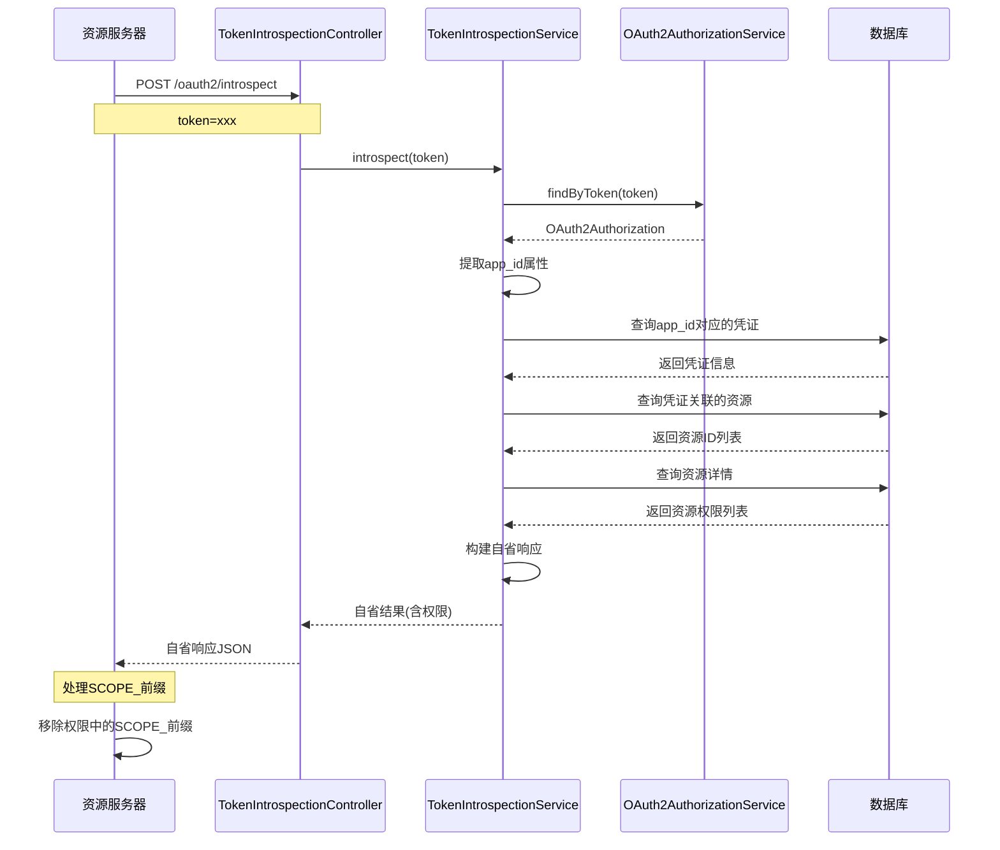
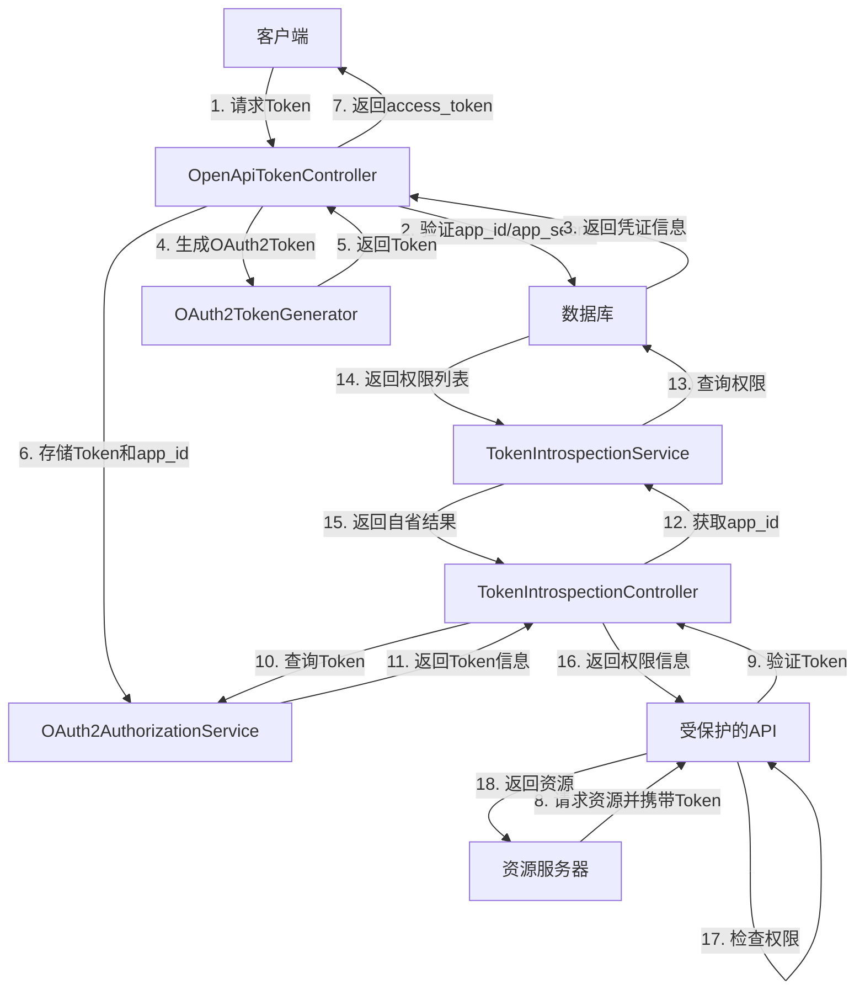

# OpenAPI 鉴权功能

## 功能概述

本模块实现了OpenAPI鉴权功能，允许客户端使用`app_id`和`app_secret`获取OAuth2访问令牌。该功能将客户端提供的应用凭证转换为标准的OAuth2客户端凭证，然后调用Spring Security OAuth2的token端点生成访问令牌。

## 流程图

### Token生成流程



### Token自省流程



### 完整认证授权流程



## 核心组件

### 1. OpenApiTokenController
- **路径**: `com.webapp.security.sso.api.OpenApiTokenController`
- **功能**: 处理OpenAPI token请求，实现凭证转换和验证
- **端点**: `POST /v2/oauth2/token`

### 2. ApiConfig
- **路径**: `com.webapp.security.sso.api.config.ApiConfig`
- **功能**: 提供API模块所需的Bean配置（如RestTemplate）

### 3. TokenIntrospectionService
- **路径**: `com.webapp.security.sso.api.service.TokenIntrospectionService`
- **功能**: 处理令牌自省请求，根据appId获取权限信息

### 4. TokenIntrospectionController
- **路径**: `com.webapp.security.sso.api.controller.TokenIntrospectionController`
- **功能**: 提供令牌自省端点，处理资源服务器的令牌验证请求
- **端点**: `POST /oauth2/introspect`

## 数据库表结构

### sys_client_credential
存储客户端凭证信息：
- `app_id`: 应用ID
- `app_secret`: 应用密钥（加密存储）
- `client_id`: 关联的OAuth2客户端ID
- `status`: 凭证状态（1=启用，0=禁用）

### sys_resource
存储API资源信息：
- `resource_code`: 资源编码
- `resource_name`: 资源名称
- `resource_path`: API路径
- `http_method`: HTTP方法

### sys_credential_resource_rel
存储凭证与资源的关联关系：
- `credential_id`: 凭证ID
- `resource_id`: 资源ID

## API使用说明

### 请求格式

```bash
curl -XPOST 'http://localhost:8080/v2/oauth2/token' \
  -H 'Authorization: Basic <Base64Encode(app_id:app_secret)>' \
  -H 'Content-Type: application/x-www-form-urlencoded' \
  --data-urlencode 'grant_type=client_credentials'
```

### 请求参数

- **Authorization头**: `Basic <credentials>`
  - credentials = Base64编码的 `app_id:app_secret`
- **Content-Type**: `application/x-www-form-urlencoded`
- **grant_type**: 必须为 `client_credentials`

### 响应格式

#### 成功响应 (200)
```json
{
  "access_token": "dae7*********************e486",
  "expires_in": 7200,
  "token_type": "Bearer"
}
```

#### 错误响应
```json
{
  "error": {
    "code": "40001",
    "message": "Invalid client credentials"
  }
}
```

### 错误码说明

| HTTP状态码 | 错误类型 | 描述 |
|-----------|---------|------|
| 400 | unsupported_grant_type | 不支持的授权类型 |
| 401 | invalid_client | 无效的客户端凭证 |
| 500 | server_error | 服务器内部错误 |

## 实现流程

### Token生成流程

1. **请求验证**: 验证grant_type和Authorization头格式
2. **凭证解析**: 解码Basic认证，提取app_id和app_secret
3. **凭证验证**: 从数据库查询凭证信息并验证
4. **状态检查**: 检查凭证是否启用
5. **密钥验证**: 使用BCrypt验证app_secret
6. **客户端匹配**: 验证client_id是否为"openapi"
7. **凭证转换**: 将app凭证转换为OAuth2客户端凭证
8. **Token生成**: 直接使用Spring Security OAuth2组件生成token
   - 获取RegisteredClient
   - 创建OAuth2ClientAuthenticationToken
   - 创建OAuth2TokenContext
   - 使用OAuth2TokenGenerator生成令牌
9. **存储appId**: 在OAuth2Authorization中添加app_id属性
   - 使用OAuth2Authorization.Builder的attribute方法添加app_id
   - 保存OAuth2Authorization到authorizationService
10. **响应返回**: 返回标准格式的token响应

### Token自省流程

1. **接收请求**: TokenIntrospectionController接收自省请求
2. **查找令牌**: 使用OAuth2AuthorizationService查找令牌对应的授权信息
3. **获取appId**: 从OAuth2Authorization的attributes中获取app_id
4. **查询权限**: 根据appId查询对应的权限信息
   - 查询sys_client_credential表获取credential_id
   - 查询sys_credential_resource_rel表获取resource_id列表
   - 查询sys_resource表获取resource_code（权限）列表
5. **构建响应**: 构建包含权限信息的自省响应
   - 添加标准字段（active, client_id, username等）
   - 添加app_id字段
   - 添加authorities字段（包含权限列表）
   - 添加scope字段（权限列表的空格分隔字符串）
6. **返回响应**: 返回自省结果给资源服务器

## 权限处理

### SCOPE_前缀问题

Spring Security OAuth2资源服务器在处理自省响应时，会自动将scope字段中的权限转换为带有SCOPE_前缀的GrantedAuthority。为了解决这个问题，有两种方案：

#### 方案1: 在资源服务器端处理（推荐）

在资源服务器（如open-api项目）中添加自定义的OpaqueTokenIntrospector：

```java
@Bean
public OpaqueTokenIntrospector opaqueTokenIntrospector(
        @Value("${spring.security.oauth2.resourceserver.opaquetoken.introspection-uri}") String introspectionUri,
        @Value("${spring.security.oauth2.resourceserver.opaquetoken.client-id}") String clientId,
        @Value("${spring.security.oauth2.resourceserver.opaquetoken.client-secret}") String clientSecret) {
    
    // 创建默认的不透明令牌自省器
    NimbusOpaqueTokenIntrospector delegate = new NimbusOpaqueTokenIntrospector(
            introspectionUri, clientId, clientSecret);
    
    // 返回自定义的不透明令牌自省器，处理权限前缀
    return new OpaqueTokenIntrospector() {
        @Override
        public OAuth2AuthenticatedPrincipal introspect(String token) {
            OAuth2AuthenticatedPrincipal principal = delegate.introspect(token);
            
            List<GrantedAuthority> updatedAuthorities = new ArrayList<>();
            
            principal.getAuthorities().forEach(authority -> {
                String name = authority.getAuthority();
                if (name.startsWith("SCOPE_")) {
                    name = name.substring(6);
                }
                updatedAuthorities.add(new SimpleGrantedAuthority(name));
            });
            
            return new DefaultOAuth2AuthenticatedPrincipal(
                    principal.getName(), principal.getAttributes(), updatedAuthorities);
        }
    };
}
```

#### 方案2: 在控制器中使用hasScope

在资源服务器的控制器中使用`hasScope`而不是`hasAuthority`：

```java
@PreAuthorize("hasScope('order:query')")  // 不需要包含前缀
@GetMapping("/orders")
public List<Order> getOrders() {
    // 查询订单逻辑
    return orderService.findAll();
}
```

## 安全配置

### SecurityConfig更新
在`SecurityConfig.java`中添加了对`/v2/oauth2/**`路径的访问许可：

```java
.antMatchers("/login", "/logout", "/oauth2/**", "/v2/oauth2/**", "/.well-known/jwks.json",
        "/api/token-blacklist/**", "/favicon.ico",
        "/css/**", "/js/**", "/images/**", "/webjars/**", "/error")
.permitAll()
```

### OAuth2客户端配置
固定使用以下OAuth2客户端配置：
- **client_id**: `openapi`
- **client_secret**: `IPSG-YbDDJ4C_tscD-OuYfrfSmVW8UKV`

## 测试

使用提供的HTTP测试文件 `OpenApiTokenController.http` 进行功能测试：

1. 正常token获取
2. 无效grant_type测试
3. 缺少Authorization头测试
4. 无效Base64编码测试
5. 不存在的appId测试

## 注意事项

1. **密钥存储**: app_secret在数据库中使用BCrypt加密存储
2. **客户端限制**: 只支持client_id为"openapi"的客户端
3. **授权类型**: 仅支持client_credentials授权类型
4. **作用域**: 使用客户端配置的默认作用域，不在请求中显式指定
5. **错误处理**: 提供详细的错误信息和状态码
6. **日志记录**: 记录关键操作和错误信息用于调试
7. **appId存储**: 在OAuth2Authorization的attributes中存储appId，用于后续权限查询
8. **权限前缀**: 资源服务器需要处理Spring Security自动添加的SCOPE_前缀

## 依赖关系

- Spring Security OAuth2 Authorization Server
- Spring Web
- MyBatis Plus
- BCrypt密码编码器
- RestTemplate HTTP客户端