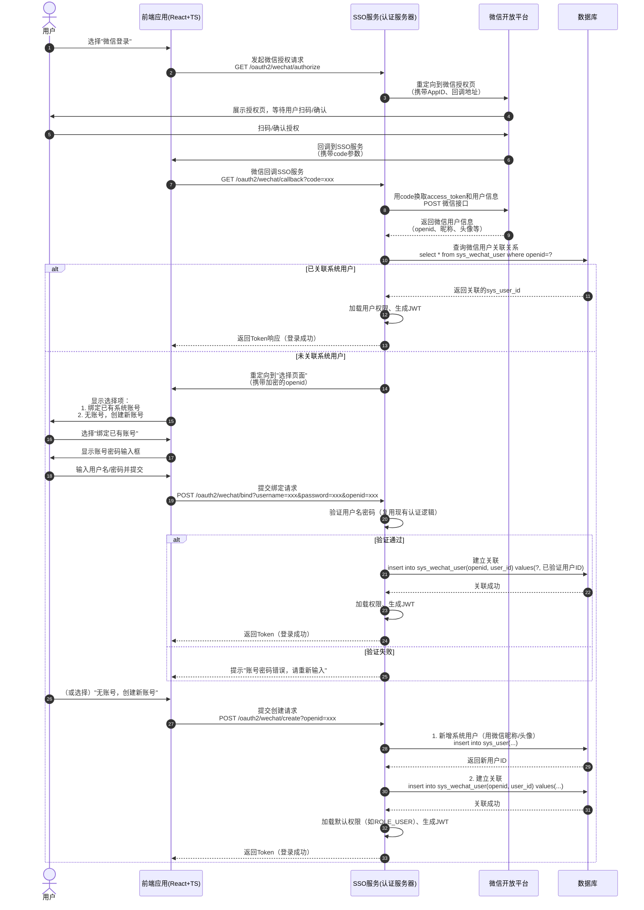

# 接入微信登录

## Security System - 企业级认证授权系统（含微信登录集成）概要设计

### 一、项目概述

基于 Spring Boot 2.7.5 + Spring Security 5.7.4 + OAuth2 的模块化认证授权系统，提供完整的用户认证、权限管理、单点登录（SSO）及第三方登录（微信）解决方案，支持 RBAC 权限模型和 JWT 令牌机制。

### 二、技术架构

#### 1. 技术栈
- **后端**：Spring Boot 2.7.5、Spring Security 5.7.4、OAuth2（spring-security-oauth2 2.5.2.RELEASE）、MyBatis-Plus、MySQL 8.0、JWT（JJWT）
- **前端**：React 18.2、TypeScript 4.9、Ant Design 5.26、Axios
- **第三方集成**：微信开放平台（网站应用）

#### 2. 项目结构

### 三、核心功能

#### 1. 原有核心功能
- **认证授权**：OAuth2 认证服务器（授权码 / 客户端凭证流程）、JWT 令牌（RSA 签名）、单点登录（SSO）
- **权限管理**：RBAC 模型（用户 - 角色 - 权限）、细粒度权限（菜单 / 按钮 / 接口）、动态权限验证
- **管理界面**：用户 / 角色 / 权限 CRUD、基于 Ant Design 的响应式 UI

#### 2. 新增微信登录功能

##### （1）功能目标
   支持用户通过微信扫码登录系统，自动关联已有账号或创建新账号，与现有账号密码登录流程兼容，保持统一的令牌格式和权限体系。

##### （2）核心流程（含用户选择环节）



##### （3）关键设计

###### 数据库扩展
新增微信用户关联表，存储微信标识与系统用户的映射：

```sql
CREATE TABLE sys_wechat_user (
id BIGINT PRIMARY KEY AUTO_INCREMENT,
openid VARCHAR(64) NOT NULL COMMENT '微信用户唯一标识',
unionid VARCHAR(64) COMMENT '微信UnionID（多应用统一标识）',
user_id BIGINT NOT NULL COMMENT '关联的系统用户ID（关联sys_user表）',
create_time DATETIME DEFAULT CURRENT_TIMESTAMP,
UNIQUE KEY uk_openid (openid),
CONSTRAINT fk_wechat_user FOREIGN KEY (user_id) REFERENCES sys_user(id)
);
```

###### 核心组件

| 组件 | 作用 |
|------|------|
| WechatOAuth2Config | 配置微信开放平台参数（AppID、AppSecret、授权 / 令牌端点） |
| WechatAuthorizationController | 处理微信授权请求（/authorize）、回调（/callback）、绑定（/bind）、创建（/create） |
| WechatUserService | 封装微信 API 调用（获取用户信息）、用户关联 / 创建逻辑 |

###### 用户关联规则
- **已关联用户**：通过openid查询sys_wechat_user表，直接获取user_id，复用现有权限。
- **未关联用户**：
  - **绑定已有账号**：验证用户输入的系统账号密码，建立openid与user_id的关联。
  - **创建新账号**：自动生成系统用户（用户名规则：wechat_{openid前8位}，默认角色ROLE_USER），并建立关联。

###### 兼容性保障
- 微信登录生成的 JWT 令牌格式与现有账号密码登录一致（包含用户 ID、权限列表），资源服务器无需修改。
- 前端接收令牌后，存储和使用方式与现有流程一致，仅需新增微信登录入口和选择页面。

### 四、安全与扩展

#### 安全措施
- 微信回调接口验证state参数防 CSRF 攻击。
- 所有与微信的通信使用 HTTPS，避免code和access_token泄露。
- 自动创建的用户密码随机生成（BCrypt 加密），用户无需知晓。

#### 扩展性
- 后续可通过新增ClientRegistration扩展其他第三方登录（如 QQ、GitHub）。
- 微信用户信息可扩展存储（如地区、性别），关联至sys_user表扩展字段。

### 五、部署说明

#### 微信开放平台配置
- 注册并实名认证微信开放平台账号，创建 "网站应用"。
- 配置授权回调域名（需与 SSO 服务域名一致，如https://sso.yourdomain.com）。
- 获取AppID和AppSecret，配置到WechatOAuth2Config中。

#### 系统部署
- 数据库初始化：执行sys_wechat_user表创建脚本。
- SSO 服务：部署时配置微信开放平台凭证及 JWT 签名密钥。

### 六、总结

本系统在原有认证授权功能基础上，通过扩展 SSO 服务集成微信登录，支持用户自主选择 "绑定已有账号" 或 "创建新账号"，保持与现有权限体系和令牌机制的兼容性。方案兼顾安全性、用户体验和扩展性，适合企业级系统的第三方登录需求。