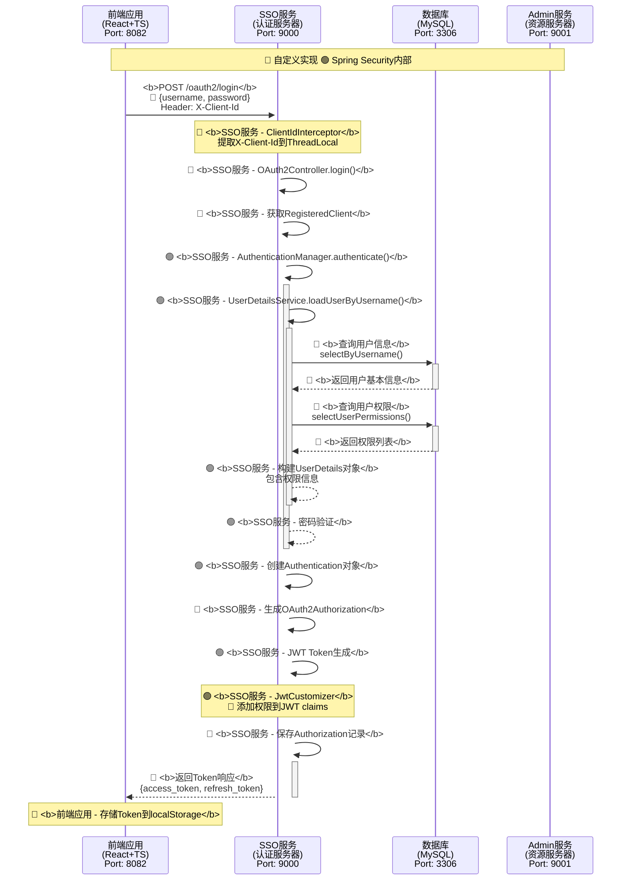
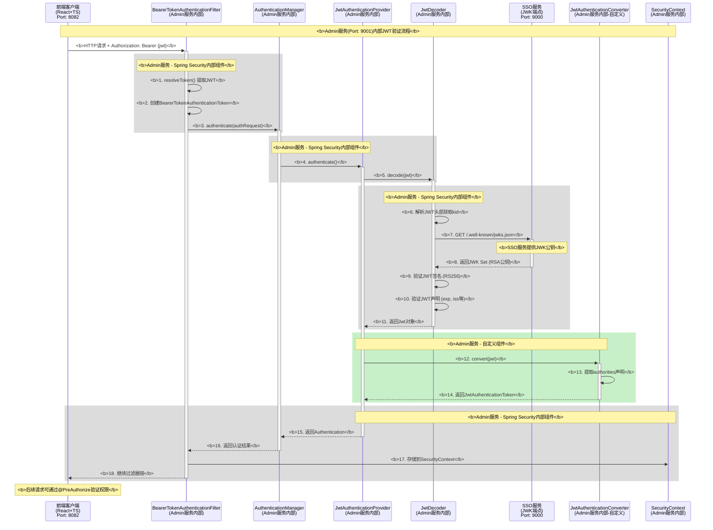
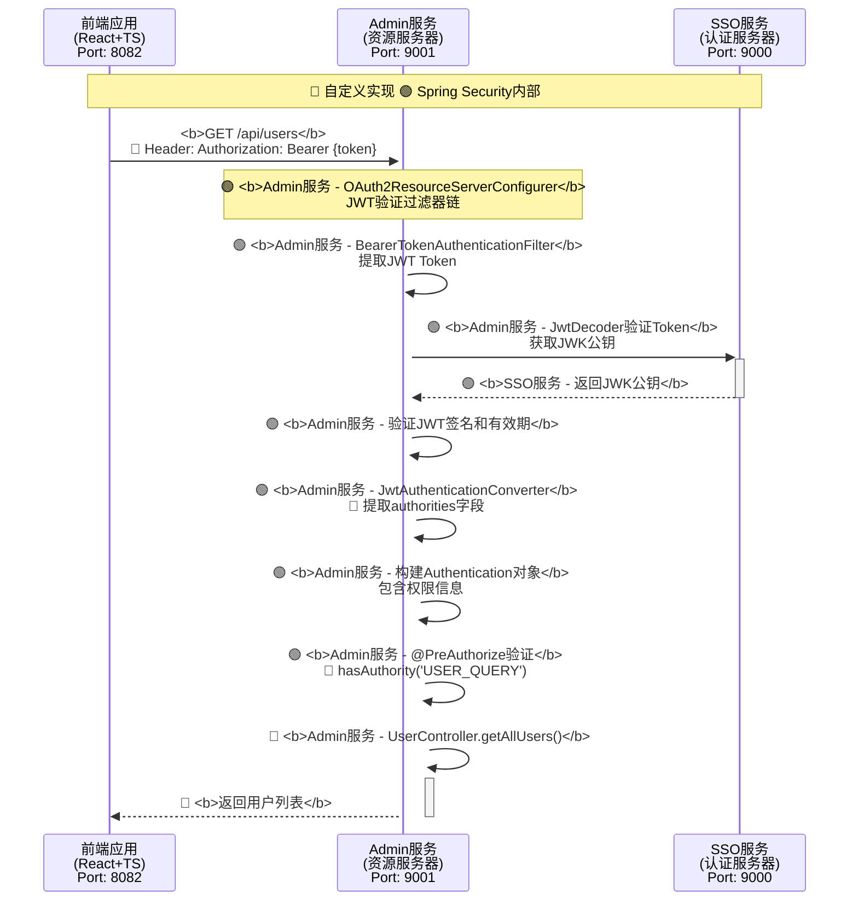

# 认证授权系统完整文档

<style>
.mermaid rect {
    fill: #2c3e50 !important;
    stroke: #34495e !important;
}

.mermaid rect + text {
    fill: #ffffff !important;
    font-weight: bold !important;
}

.mermaid .rect text {
    fill: #ffffff !important;
    font-weight: bold !important;
}

.mermaid g.note text {
    fill: #ffffff !important;
    font-weight: bold !important;
}

.mermaid .node rect {
    fill: #2c3e50 !important;
    stroke: #34495e !important;
}

.mermaid .node text {
    fill: #ffffff !important;
    font-weight: bold !important;
}
</style>

## 系统概述

本系统基于 **Spring Boot 2.7.5** 和 **Spring Security OAuth2 Authorization Server 0.4.5** 构建，采用微服务架构，实现了完整的 OAuth2 认证授权和 RBAC 权限管理。

### 系统架构

```
┌─────────────────┐    ┌─────────────────┐    ┌─────────────────┐
│   前端应用      │    │   Admin服务     │    │   SSO服务       │
│  (React+TS)     │    │  (资源服务器)   │    │  (认证服务器)   │
│  Port: 8082     │    │  Port: 9001     │    │  Port: 9000     │
└─────────────────┘    └─────────────────┘    └─────────────────┘
         │                       │                       │
         │                       │                       │
         └───────────────────────┼───────────────────────┘
                                 │
                    ┌─────────────────┐
                    │   MySQL数据库   │
                    │   Port: 3306    │
                    └─────────────────┘
```

## 1. SSO 登录流程详解

### 1.1 登录接口调用流程



### 1.2 登录流程详细步骤

#### 步骤1: 前端发起登录请求
```typescript
// authService.ts
const response = await authApi.post('/oauth2/login', { 
  username, 
  password 
});
```

**处理内容:**
- 前端使用 `authApi` 实例发送请求
- 自动携带 `X-Client-Id: webapp-client` 头部
- 请求体包含用户名和密码

#### 步骤2: SSO服务接收请求
```java
// OAuth2Controller.java
@PostMapping("/login")
public ResponseEntity<?> login(@RequestBody LoginRequest loginRequest)
```

**处理内容:**
- `ClientIdInterceptor` 拦截请求，提取 `X-Client-Id` 到 `ThreadLocal`
- 验证客户端ID的有效性
- 获取 `RegisteredClient` 配置信息

#### 步骤3: 用户认证
```java
// UserDetailsServiceImpl.java
public UserDetails loadUserByUsername(String username)
```

**处理内容:**
- 查询用户基本信息: `sysUserMapper.selectByUsername(username)`
- 查询用户权限列表: `sysUserMapper.selectUserPermissions(userId)`
- 权限查询SQL:
```sql
SELECT DISTINCT sp.perm_code 
FROM sys_user su 
JOIN sys_user_role sur ON su.user_id = sur.user_id 
JOIN sys_role sr ON sur.role_id = sr.role_id 
JOIN sys_role_permission srp ON sr.role_id = srp.role_id 
JOIN sys_permission sp ON srp.permission_id = sp.permission_id 
WHERE su.user_id = #{userId} 
AND su.status = 1 AND su.deleted = 0 
AND sr.status = 1 AND sr.deleted = 0 
AND sp.status = 1 AND sp.deleted = 0
```
- 构建 `UserDetails` 对象，包含权限信息

#### 步骤4: JWT Token生成
```java
// JwtConfig.java
@Bean
public OAuth2TokenCustomizer<JwtEncodingContext> jwtCustomizer()
```

**处理内容:**
- Spring Security 生成基础 JWT Token
- `JwtCustomizer` 将用户权限添加到 JWT claims 中
- 权限信息存储在 `authorities` 字段

#### 步骤5: 返回认证结果
```json
{
  "success": true,
  "access_token": "eyJhbGciOiJSUzI1NiIs...",
  "refresh_token": "eyJhbGciOiJSUzI1NiIs...",
  "token_type": "Bearer",
  "expires_in": 3600,
  "refresh_expires_in": 7200
}
```

## 2. Admin服务用户信息认证流程

### 2.1 Admin服务JWT验证详细流程图



### 2.2 Token验证流程



### 2.3 认证流程详细步骤

#### 步骤1: 前端携带Token请求
```typescript
// api.ts - businessApi请求拦截器
config.headers.Authorization = `Bearer ${accessToken}`;
```

**处理内容:**
- 前端自动在请求头中添加 `Authorization: Bearer {access_token}`
- 使用 `businessApi` 实例发送业务请求

#### 步骤2: Admin服务JWT验证详解

##### 2.1 Spring Security过滤器链配置
```java
// SecurityConfig.java
@Bean
public SecurityFilterChain filterChain(HttpSecurity http) throws Exception {
    http
        .authorizeRequests(authz -> authz
            .antMatchers("/api/**").authenticated()  // API需要认证
            .anyRequest().authenticated())
        .oauth2ResourceServer(oauth2 -> oauth2      // 配置为OAuth2资源服务器
            .jwt(jwt -> jwt.jwtAuthenticationConverter(jwtAuthenticationConverter())));
    return http.build();
}
```

##### 2.2 BearerTokenAuthenticationFilter工作机制

**🔴 重要说明：这是Admin服务(Port: 9001)内部的过滤器，不是调用外部服务！**

```java
// Admin服务内部 - Spring Security内部流程（简化版）
public class BearerTokenAuthenticationFilter extends OncePerRequestFilter {
    
    @Override
    protected void doFilterInternal(HttpServletRequest request, 
                                  HttpServletResponse response, 
                                  FilterChain filterChain) {
        
        // 1. 从请求头提取Bearer Token
        String token = resolveToken(request);
        if (token != null) {
            // 2. 创建BearerTokenAuthenticationToken
            BearerTokenAuthenticationToken authRequest = 
                new BearerTokenAuthenticationToken(token);
            
            // 3. 委托给AuthenticationManager进行认证
            Authentication authResult = 
                this.authenticationManager.authenticate(authRequest);
            
            // 4. 将认证结果存储到SecurityContext
            SecurityContextHolder.getContext().setAuthentication(authResult);
        }
        
        filterChain.doFilter(request, response);
    }
    
    private String resolveToken(HttpServletRequest request) {
        String bearerToken = request.getHeader("Authorization");
        if (StringUtils.hasText(bearerToken) && bearerToken.startsWith("Bearer ")) {
            return bearerToken.substring(7); // 移除"Bearer "前缀
        }
        return null;
    }
}
```

##### 2.3 JwtAuthenticationProvider认证流程

```java
// Admin服务内部 - Spring Security内部的JWT认证提供者
public class JwtAuthenticationProvider implements AuthenticationProvider {
    
    private final JwtDecoder jwtDecoder;
    private final JwtAuthenticationConverter jwtAuthenticationConverter;
    
    @Override
    public Authentication authenticate(Authentication authentication) {
        BearerTokenAuthenticationToken bearer = 
            (BearerTokenAuthenticationToken) authentication;
        
        // 1. 解码和验证JWT
        Jwt jwt = this.jwtDecoder.decode(bearer.getToken());
        
        // 2. 转换为Authentication对象
        AbstractAuthenticationToken token = 
            this.jwtAuthenticationConverter.convert(jwt);
        
        return token;
    }
}
```

##### 2.4 JwtDecoder详细工作流程

```java
// Admin服务的JWT解码器配置
// application.yml中配置的issuer-uri会自动配置JwtDecoder
spring:
  security:
    oauth2:
      resourceserver:
        jwt:
          issuer-uri: http://localhost:9000  # SSO服务地址
```

**🔴 JwtDecoder内部工作机制 (Admin服务内部组件):**

```java
// Admin服务内部 - Spring Security内部实现（简化版）
public class NimbusJwtDecoder implements JwtDecoder {
    
    private final JWKSource<SecurityContext> jwkSource;
    
    @Override
    public Jwt decode(String token) throws JwtException {
        
        // 1. 解析JWT头部，获取kid（密钥ID）
        JWSHeader header = parseHeader(token);
        String keyId = header.getKeyID();
        
        // 2. 从JWK Set获取对应的公钥
        // 🔴 这里Admin服务会向SSO服务(Port: 9000)的 /.well-known/jwks.json 端点请求
        JWK jwk = this.jwkSource.get(keyId);
        RSAKey rsaKey = (RSAKey) jwk;
        
        // 3. 验证JWT签名
        JWSVerifier verifier = new RSASSAVerifier(rsaKey.toRSAPublicKey());
        SignedJWT signedJWT = SignedJWT.parse(token);
        
        if (!signedJWT.verify(verifier)) {
            throw new JwtValidationException("JWT signature validation failed");
        }
        
        // 4. 验证JWT声明（过期时间、发行者等）
        JWTClaimsSet claims = signedJWT.getJWTClaimsSet();
        validateClaims(claims);
        
        // 5. 构建Jwt对象
        return createJwt(token, claims);
    }
    
    private void validateClaims(JWTClaimsSet claims) {
        // 验证过期时间
        Date expirationTime = claims.getExpirationTime();
        if (expirationTime != null && expirationTime.before(new Date())) {
            throw new JwtValidationException("JWT has expired");
        }
        
        // 验证发行者
        String issuer = claims.getIssuer();
        if (!expectedIssuer.equals(issuer)) {
            throw new JwtValidationException("Invalid issuer");
        }
        
        // 验证受众等其他声明...
    }
}
```

##### 2.5 JWK公钥获取机制

**🔴 Admin服务(Port: 9001)如何获取SSO服务(Port: 9000)的公钥:**

```java
// Admin服务内部 - Spring Boot自动配置会创建JwtDecoder
@Configuration
public class OAuth2ResourceServerJwtConfiguration {
    
    @Bean
    @ConditionalOnProperty(name = "spring.security.oauth2.resourceserver.jwt.issuer-uri")
    public JwtDecoder jwtDecoder(OAuth2ResourceServerProperties properties) {
        String issuerUri = properties.getJwt().getIssuerUri();
        
        // 构建JWK Set URI: {issuerUri}/.well-known/jwks.json
        String jwkSetUri = issuerUri + "/.well-known/jwks.json";
        
        // 创建基于JWK Set URI的解码器
        return NimbusJwtDecoder.withJwkSetUri(jwkSetUri)
            .cache(Duration.ofMinutes(5))  // 缓存5分钟
            .build();
    }
}
```

**🔴 实际的HTTP请求流程 (服务间通信):**

```
Admin服务(Port: 9001) --> GET http://localhost:9000/.well-known/jwks.json
SSO服务(Port: 9000)   --> 返回JWK Set JSON:
{
  "keys": [
    {
      "kty": "RSA",
      "kid": "webapp-key-2024",
      "use": "sig",
      "alg": "RS256",
      "n": "0vx7agoebGcQSuuPiLJXZptN9nndrQmbXEps2aiAFbWhM78LhWx4cbbfAAtVT86zwu1RK7aPFFxuhDR1L6tSoc_BJECPebWKRXjBZCiFV4n3oknjhMstn64tZ_2W-5JsGY4Hc5n9yBXArwl93lqt7_RN5w6Cf0h4QyQ5v-65YGjQR0_FDW2QvzqY368QQMicAtaSqzs8KJZgnYb9c7d0zgdAZHzu6qMQvRL5hajrn1n91CbOpbISD08qNLyrdkt-bFTWhAI4vMQFh6WeZu0fM4lFd2NcRwr3XPksINHaQ-G_xBniIqbw0Ls1jF44-csFCur-kEgU8awapJzKnqDKgw",
      "e": "AQAB"
    }
  ]
}
```

##### 2.6 Admin服务启动时的自动配置

**🔴 Admin服务(Port: 9001) - Spring Boot如何自动配置这些组件:**

```java
// Admin服务内部 - Spring Boot启动时的自动配置流程
@Configuration
@ConditionalOnClass({JwtDecoder.class, OAuth2ResourceServerProperties.class})
public class OAuth2ResourceServerJwtConfiguration {
    
    // 1. 读取application.yml配置
    @ConfigurationProperties("spring.security.oauth2.resourceserver.jwt")
    public static class JwtProperties {
        private String issuerUri = "http://localhost:9000";
        // getter/setter...
    }
    
    // 2. 自动创建JwtDecoder Bean
    @Bean
    @ConditionalOnMissingBean
    public JwtDecoder jwtDecoder(JwtProperties properties) {
        String jwkSetUri = properties.getIssuerUri() + "/.well-known/jwks.json";
        return NimbusJwtDecoder.withJwkSetUri(jwkSetUri)
            .cache(Duration.ofMinutes(5))  // 缓存JWK 5分钟
            .build();
    }
    
    // 3. 自动创建JwtAuthenticationProvider
    @Bean
    @ConditionalOnMissingBean
    public JwtAuthenticationProvider jwtAuthenticationProvider(
            JwtDecoder jwtDecoder, 
            JwtAuthenticationConverter jwtAuthenticationConverter) {
        JwtAuthenticationProvider provider = new JwtAuthenticationProvider(jwtDecoder);
        provider.setJwtAuthenticationConverter(jwtAuthenticationConverter);
        return provider;
    }
    
    // 4. 自动配置AuthenticationManager
    @Bean
    @ConditionalOnMissingBean
    public AuthenticationManager authenticationManager(
            List<AuthenticationProvider> providers) {
        return new ProviderManager(providers);
    }
    
    // 5. 自动添加BearerTokenAuthenticationFilter到过滤器链
    @Bean
    public BearerTokenAuthenticationFilter bearerTokenAuthenticationFilter(
            AuthenticationManager authenticationManager) {
        return new BearerTokenAuthenticationFilter(authenticationManager);
    }
}
```

**🔴 Admin服务(Port: 9001)启动日志示例:**
```
2024-01-15 10:30:15.123  INFO --- [main] o.s.s.o.r.j.JwtDecoder : 
    [Admin服务] Configured JWT decoder with JWK Set URI: http://localhost:9000/.well-known/jwks.json

2024-01-15 10:30:15.456  INFO --- [main] o.s.s.w.DefaultSecurityFilterChain : 
    [Admin服务] Will secure any request with [
        ...
        BearerTokenAuthenticationFilter,
        ...
    ]

2024-01-15 10:30:15.789  INFO --- [main] o.s.b.w.embedded.tomcat.TomcatWebServer : 
    [Admin服务] Tomcat started on port(s): 9001 (http) with context path ''
```

**🔴 处理内容总结 (明确服务归属):**
1. **Token提取**: Admin服务内部的 `BearerTokenAuthenticationFilter` 从 `Authorization` 头部提取 JWT Token
2. **公钥获取**: Admin服务内部的 `JwtDecoder` 向 SSO服务(Port: 9000) 的 `/.well-known/jwks.json` 端点获取 JWK 公钥（带缓存）
3. **签名验证**: Admin服务内部使用 RSA 公钥验证 JWT 的 RS256 签名
4. **声明验证**: Admin服务内部验证 Token 的有效期、发行者、受众等声明
5. **权限提取**: Admin服务内部通过自定义的 `JwtAuthenticationConverter` 从 JWT 的 `authorities` 字段提取权限信息
6. **自动配置**: Admin服务启动时，Spring Boot 根据 `application.yml` 中的 `issuer-uri` 自动配置所有必要组件

#### 步骤3: 权限信息提取
```java
// SecurityConfig.java - JwtAuthenticationConverter
authoritiesConverter.setAuthoritiesClaimName("authorities");
authoritiesConverter.setAuthorityPrefix("");
```

**处理内容:**
- 从 JWT 的 `authorities` 字段提取权限信息
- 移除默认的 `SCOPE_` 前缀
- 构建 `Authentication` 对象，包含用户权限

#### 步骤4: 方法级权限验证
```java
// UserController.java
@PreAuthorize("hasAuthority('USER_QUERY')")
public ResponseEntity<List<SysUser>> getAllUsers()
```

**处理内容:**
- Spring Security 的 `@PreAuthorize` 注解验证权限
- 检查当前用户是否具有 `USER_QUERY` 权限
- 权限验证通过后执行业务逻辑

### 2.4 权限验证机制

#### RBAC权限模型
```
用户(User) ──→ 用户角色(UserRole) ──→ 角色(Role) ──→ 角色权限(RolePermission) ──→ 权限(Permission)
```

#### 权限类型
- **菜单权限**: 控制页面访问 (perm_type = 1)
- **操作权限**: 控制功能操作 (perm_type = 2)

#### 权限编码示例
- `USER_QUERY`: 用户查询权限
- `USER_CREATE`: 用户创建权限  
- `USER_UPDATE`: 用户更新权限
- `USER_DELETE`: 用户删除权限

## 3. 核心配置说明

### 3.1 SSO服务配置

#### OAuth2客户端配置
```sql
-- oauth2_registered_client表
INSERT INTO oauth2_registered_client VALUES (
    'webapp-client',
    'webapp-client',
    '{bcrypt}$2a$10$...',  -- 客户端密钥
    'client_secret_basic',
    'authorization_code,refresh_token,client_credentials',
    'http://localhost:8080/login/oauth2/code/webapp-client',
    'read,write,openid,profile',
    '{"settings.client.require-authorization-consent":false}',
    '{"settings.token.access-token-time-to-live":["java.time.Duration",3600.000000000]}'
);
```

#### JWT配置
```java
// JwtConfig.java
@Bean
public OAuth2TokenCustomizer<JwtEncodingContext> jwtCustomizer() {
    return context -> {
        if (context.getTokenType().getValue().equals("access_token")) {
            Collection<? extends GrantedAuthority> authorities = 
                context.getPrincipal().getAuthorities();
            List<String> authoritiesList = authorities.stream()
                .map(GrantedAuthority::getAuthority)
                .collect(Collectors.toList());
            context.getClaims().claim("authorities", authoritiesList);
        }
    };
}
```

### 3.2 Admin服务配置

#### 资源服务器配置
```yaml
# application.yml
spring:
  security:
    oauth2:
      resourceserver:
        jwt:
          issuer-uri: http://localhost:9000
```

#### JWT权限转换器
```java
// SecurityConfig.java
@Bean
public JwtAuthenticationConverter jwtAuthenticationConverter() {
    JwtGrantedAuthoritiesConverter authoritiesConverter = 
        new JwtGrantedAuthoritiesConverter();
    authoritiesConverter.setAuthoritiesClaimName("authorities");
    authoritiesConverter.setAuthorityPrefix("");
    
    JwtAuthenticationConverter jwtConverter = new JwtAuthenticationConverter();
    jwtConverter.setJwtGrantedAuthoritiesConverter(authoritiesConverter);
    return jwtConverter;
}
```

## 4. 安全特性

### 4.1 Token安全
- **RSA签名**: 使用RSA-256算法签名JWT
- **密钥轮换**: 支持JWK密钥轮换机制
- **Token过期**: Access Token 1小时，Refresh Token 2小时

### 4.2 权限安全
- **最小权限原则**: 用户只获得必需的权限
- **权限继承**: 通过角色继承权限
- **动态权限**: 支持运行时权限变更

### 4.3 会话安全
- **无状态**: 基于JWT的无状态认证
- **自动刷新**: 前端自动处理Token刷新
- **安全存储**: Token存储在localStorage中

## 5. 流程图总结

### 5.1 完整认证授权流程

```mermaid
graph TD
    A[前端登录请求<br/>Port: 8082] --> B[SSO服务验证<br/>Port: 9000]
    B --> C[查询用户信息<br/>MySQL: 3306]
    C --> D[查询用户权限<br/>MySQL: 3306]
    D --> E[SSO服务生成JWT Token<br/>Port: 9000]
    E --> F[SSO服务返回Token<br/>Port: 9000]
    F --> G[前端存储Token<br/>Port: 8082]
    G --> H[业务请求携带Token<br/>Port: 8082]
    H --> I[Admin服务验证Token<br/>Port: 9001]
    I --> J[Admin服务提取权限信息<br/>Port: 9001]
    J --> K[Admin服务@PreAuthorize验证<br/>Port: 9001]
    K --> L[Admin服务执行业务逻辑<br/>Port: 9001]
    
    style A fill:#e1f5fe
    style B fill:#e8f5e8
    style C fill:#e1f5fe
    style D fill:#e1f5fe
    style E fill:#e8f5e8
    style F fill:#e8f5e8
    style G fill:#e1f5fe
    style H fill:#e1f5fe
    style I fill:#e8f5e8
    style J fill:#e8f5e8
    style K fill:#e8f5e8
    style L fill:#e1f5fe
```

### 5.2 权限验证流程

```mermaid
graph LR
    A[用户<br/>MySQL] --> B[角色<br/>MySQL]
    B --> C[权限<br/>MySQL]
    C --> D[JWT Token<br/>SSO服务: 9000]
    D --> E[Admin服务<br/>Port: 9001]
    E --> F[@PreAuthorize<br/>Admin服务]
    F --> G[业务方法<br/>Admin服务]
    
    style A fill:#e1f5fe
    style B fill:#e1f5fe
    style C fill:#e1f5fe
    style D fill:#e8f5e8
    style E fill:#e8f5e8
    style F fill:#e8f5e8
    style G fill:#e1f5fe
```

## 6. 关键技术点

### 6.1 Spring Security内部机制
- **AuthenticationManager**: 认证管理器
- **UserDetailsService**: 用户详情服务
- **JwtDecoder**: JWT解码器
- **OAuth2ResourceServer**: 资源服务器配置

### 6.2 自定义实现
- **ClientIdInterceptor**: 客户端ID拦截器
- **OAuth2Controller**: 自定义登录控制器
- **JwtCustomizer**: JWT自定义器
- **UserDetailsServiceImpl**: 用户详情服务实现

### 6.3 数据库设计
- **用户表**: sys_user
- **角色表**: sys_role  
- **权限表**: sys_permission
- **用户角色关联表**: sys_user_role
- **角色权限关联表**: sys_role_permission

## 7. 总结

本系统实现了完整的OAuth2认证授权机制，结合Spring Security的强大功能和自定义业务逻辑，提供了安全、可靠、易扩展的认证授权解决方案。通过JWT Token携带权限信息，实现了无状态的分布式权限验证，支持细粒度的权限控制和动态权限管理。